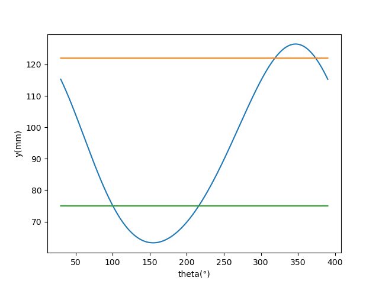

# 凸轮+连杆设计 参数

## 物料

ABS塑料，50*50*80，W=50,H=50,L=80
正压力N=20N(f=0.1N)
移动距离 W+d=50+1.5=51.5

## 齿轮

m=1,z=60,轴直径：10

## 曲柄滑块->左夹

e=30
a=30
b=100
轨迹：y=a*np.cos(theta)+np.sqrt(b^2-(e+a*np.sin(theta))^2)

## 凸轮->右夹,弹簧

弹簧：L=20,,k=2e4N/m,F=20N时 detlaL=1mm
滑块机构直径：d=3
